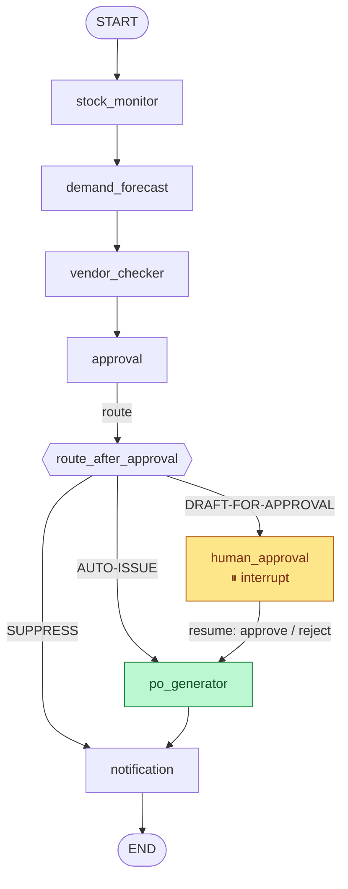

# Orchestration — the LangGraph state machine (Phase 2)

Phase 1 gave us six deterministic agents that each read and write one shared
state object. Phase 2 **wires them into a [LangGraph](https://langchain-ai.github.io/langgraph/)
state graph** with a conditional fork on the autonomy tier and a real
human-in-the-loop *pause* on the draft path.

Nothing in the routing logic changed — the Approval Agent still makes the call.
The graph only decides **what runs next** based on that call, and physically
stops the draft path before any PO can be written.

- Graph + nodes: [`orchestration/graph.py`](../orchestration/graph.py)
- State schema: [`orchestration/state.py`](../orchestration/state.py)
- Run / resume / batch: [`orchestration/runner.py`](../orchestration/runner.py)
- Acceptance check: [`scripts/validate_phase2.py`](../scripts/validate_phase2.py)

---

## The graph



**Reading the three branches:**

| Tier | Path through the graph | PO write? |
|------|------------------------|-----------|
| **AUTO-ISSUE** | `… → approval → po_generator → notification → END` | yes — status `ISSUED` |
| **DRAFT-FOR-APPROVAL** | `… → approval → human_approval ⏸ → po_generator → notification → END` | only after an **approving** resume — status `APPROVED` |
| **SUPPRESS** | `… → approval → notification → END` (skips `po_generator`) | never |

The suppress branch never visits `po_generator`, so the guardrail can't even be
*reached* on a false alarm. The draft branch reaches `po_generator` only after a
human resume; the PO Generator's own guardrail (`_write_allowed`) then writes the
PO only when `human_approved` is true — a rejection passes through and writes
nothing.

### Nodes

Each node is a thin wrapper over a Phase-1 agent's `run(state)` and returns only
the state fields it filled (a LangGraph channel update):

| Node | Agent | Writes to state |
|------|-------|-----------------|
| `stock_monitor` | `stock_monitor.run` | `stock` |
| `demand_forecast` | `demand_forecast.run` | `forecast` |
| `vendor_checker` | `vendor_checker.run` | `vendor` |
| `approval` | `approval.run` | `decision`, `route` |
| `human_approval` | *(interrupt)* | `human_approved`, `approved_by` |
| `po_generator` | `po_generator.run` | `po` |
| `notification` | `notification.run` | `notification` |

The agents already open their own DB session, append their audit row, and commit
inside `run()`. So the **audit trail is produced just by letting every node
run** — there is no orchestration-level audit code, and no session is held open
across the interrupt (which could not survive a pause/resume anyway). A completed
run leaves one `audit_log` row per agent under its `run_id`; the validator asserts
all six are present.

---

## State schema

The graph state is [`GraphState`](../orchestration/state.py) — the Phase-1
[`ReplenishmentState`](../agents/state.py) plus one hoisted field, `route`. The
agents type against the base class and accept the subclass transparently.

| Field | Type | Set by | Meaning |
|-------|------|--------|---------|
| `run_id` | `str` | caller | correlation id tying this run's audit rows |
| `sku` | `str` | caller | the SKU being processed |
| `stock` | `StockStatus \| None` | `stock_monitor` | breach / suppress verdict + effective stock |
| `forecast` | `ForecastResult \| None` | `demand_forecast` | order qty (or advisory cover) |
| `vendor` | `VendorAssessment \| None` | `vendor_checker` | supplier eligibility + recommended route |
| `decision` | `ApprovalDecision \| None` | `approval` | the autonomy-tier decision + justification payload |
| `route` | `AutonomyTier \| None` | `approval` | **hoisted** mirror of `decision.tier`; the fork keys on it |
| `human_approved` | `bool \| None` | `human_approval` | `None` until a human rules on a draft |
| `approved_by` | `str \| None` | `human_approval` | approver handle, recorded on the PO |
| `po` | `POResult \| None` | `po_generator` | written PO, or skipped with a reason |
| `notification` | `NotificationResult \| None` | `notification` | the DP-facing message |
| `errors` | `list[str]` | any | non-fatal issues for the dashboard |

Why hoist `route` when `decision.tier` already holds it? So the conditional edge
([`route_after_approval`](../orchestration/graph.py)) is a single, obvious field
read rather than a reach into a nested model, and so the dashboard can colour a
run by its route without unpacking the decision. The approval node keeps the two
in sync (`route = decision.tier`).

Two helper models describe the human boundary:

- **`ApprovalRequest`** — the payload surfaced by the interrupt (the deterministic
  facts a planner needs: SKU, vendor, qty, reason, structured justification).
- **`HumanDecision`** — the value passed back to resume (`approved`,
  `approved_by`, `note`).

---

## How the interrupt / resume works

The draft path uses LangGraph's [`interrupt`](https://langchain-ai.github.io/langgraph/how-tos/human_in_the_loop/wait-user-input/)
together with a **checkpointer** (an in-memory `MemorySaver`, created when the
graph is compiled). The flow:

1. **Run.** `run_for_sku("SKU-456")` invokes the graph with a `thread_id`. The
   first four nodes run; the approval node sets `route = DRAFT_FOR_APPROVAL`; the
   fork sends execution to `human_approval`.
2. **Pause.** Inside `human_approval`, `interrupt(request)` **suspends the whole
   graph** and saves a checkpoint under the `thread_id`. `run_for_sku` returns a
   `RunOutcome` with `status="paused"`, `paused_for_approval=True`, and the
   `ApprovalRequest` attached. **No node past the interrupt has executed — the PO
   write has not happened.**
3. **Decide (human).** A planner (the Streamlit dashboard, or the validator)
   inspects the request and chooses approve or reject.
4. **Resume.** `resume_run(thread_id, approved=…, approved_by=…)` re-invokes the
   graph with `Command(resume=HumanDecision(...).model_dump())`. The
   `interrupt(...)` call *returns that value*, the node publishes
   `human_approved` / `approved_by`, and execution continues to `po_generator`:
   - **approve →** the guardrail allows the write; PO status `APPROVED`.
   - **reject →** the guardrail forbids the write; `po.written=False`, no PO row.
5. **Finish.** `notification` runs and the graph reaches `END`. `resume_run`
   returns a completed `RunOutcome`.

Because the checkpointer is one shared instance for the process, the thread paused
by `run_for_sku` is the same thread `resume_run` continues — keyed only by
`thread_id`.

> **Checkpointer choice.** The phase allows an in-memory *or* SQLite checkpointer;
> we use `MemorySaver`. (`langgraph-checkpoint-sqlite` is a separate, optional
> package; in-memory is sufficient for a single-process demo and keeps the
> dependency surface minimal. Swapping in a `SqliteSaver` is a one-line change in
> [`build_graph`](../orchestration/graph.py) if cross-process resume is ever
> needed.)

---

## Running it

```bash
python scripts/seed_data.py        # deterministic seed (drops & recreates poc.db)
python scripts/validate_phase2.py  # re-seeds, then drives S1–S4 through the graph
```

Programmatic use:

```python
from orchestration import runner

# S1 — auto-issue, completes end to end
o = runner.run_for_sku("SKU-123")
assert o.status == "completed" and o.po_written

# S2 — draft, pauses for a human
o = runner.run_for_sku("SKU-456", thread_id="demo-456")
assert o.paused_for_approval
print(o.approval_request)                      # what the planner sees
done = runner.resume_run("demo-456", approved=True, approved_by="@dp.demo")
assert done.po_written                         # PO written only after approval

# S4 — suppress, never writes a PO
o = runner.run_for_sku("SKU-212")
assert o.route.display == "SUPPRESS" and not o.po_written

# S3 — seasonal batch: 3 consolidated POs (7 SKUs) + 1 paused draft (SKU-708)
b = runner.run_batch([f"SKU-{n}" for n in range(701, 709)])
assert len(b.consolidated_pos) == 3 and len(b.draft_runs) == 1
```

### Batch consolidation (S3)

`run_batch` is a deterministic coordinator, not a per-SKU graph run, because
**consolidation is a batch property**: it groups the auto-issue SKUs by their
shared approved vendor (`vendor_checker.consolidate_by_vendor`) and writes **one
PO per vendor with many lines** (`po_generator.generate_consolidated`). The
suspended-vendor SKU (SKU-708, Vendor-YZ1) is excluded from consolidation and run
through the real single-SKU graph, so it comes back **paused** like any other
draft. Result for the seeded batch: `Vendor-PQR` (3 lines), `Vendor-STU` (2),
`Vendor-VWX` (2) = 3 POs / 7 lines, plus SKU-708 paused.
